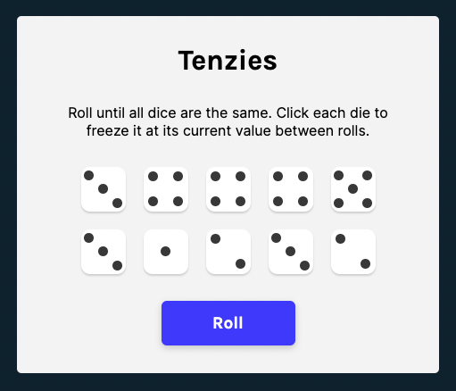

# Tenzies

A solo project from the [Scrimba Frontend Developer Career Path](https://scrimba.com/learn/frontend)

## Table of Contents

- [Overview](#overview)
  - [Requirements](#requirements)
  - [Screenshots](#screenshots)
  - [Links](#links)
  - [Built with](#built-with)

## Overview

### Requirements

- [x] Create a Tenzies game using React
    - [x] useEffect and useState hooks
    - [x] Conditionally render elements and styles
- [x] Stretch goal: Use CSS to put real dots on the dice

### Screenshot

### Links

- Live Site URL: [GitHub Pages](https://xchristinawu.github.io/tenzies/)

### Built with

- HTML, CSS, JavaScript, React
